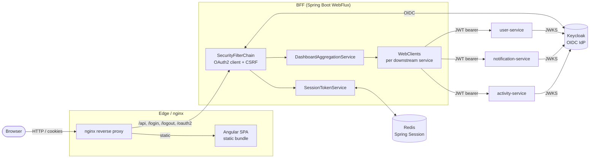
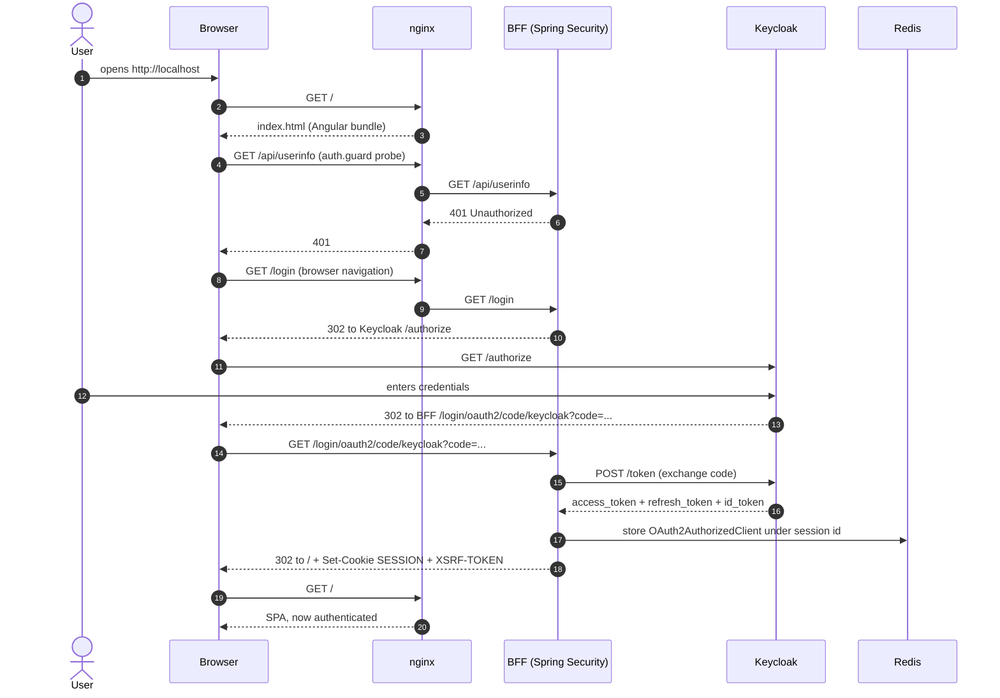
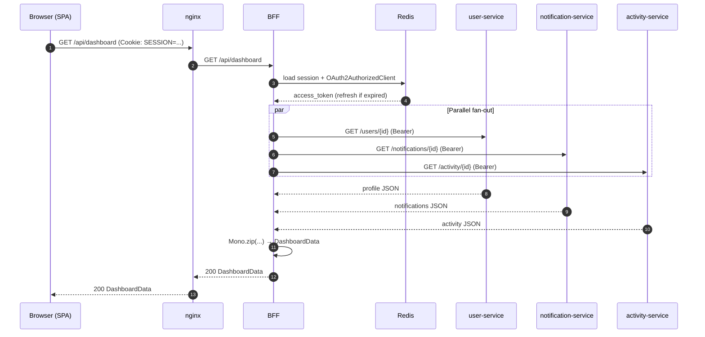

# Architecture

This document describes the architecture of the BFF reference project: the
components, how they communicate, and the three core data flows (login, API
call and logout).

## Component overview



### Components

| Component             | Tech                          | Responsibility                                                                 |
|-----------------------|-------------------------------|--------------------------------------------------------------------------------|
| Angular SPA           | Angular 21, standalone, signals | Render dashboard, no auth logic, no token handling                           |
| nginx                 | nginx alpine                  | Serve SPA, reverse-proxy `/api`, `/login`, `/logout`, `/oauth2` to BFF         |
| BFF                   | Spring Boot 3 WebFlux         | OAuth2 client, session, CSRF, parallel aggregation                             |
| Keycloak              | Keycloak 26                   | OIDC Identity Provider, JWKS endpoint                                          |
| Redis                 | Redis 7 alpine                | Session store (`spring-session-data-redis`)                                    |
| user-service          | Spring Boot 3 Resource Server | Profile data; validates JWT against Keycloak JWKS                              |
| notification-service  | Spring Boot 3 Resource Server | Notifications; same JWT validation                                             |
| activity-service      | Spring Boot 3 Resource Server | Activity events; same JWT validation                                           |

### Hexagonal layout (BFF)

```
io.janda.bff
├── BffApplication
├── config        # SecurityConfig, RedisConfig, WebClientConfig, CorsConfig, BffProperties
├── domain
│   ├── model     # DashboardData, UserProfile, Notification, ActivityEvent…
│   └── port      # UserServicePort, NotificationServicePort, ActivityServicePort
├── application   # DashboardAggregationService, SessionTokenService
├── adapter
│   ├── web       # DashboardController, AuthController + DTOs
│   └── client    # UserServiceClient, NotificationServiceClient, ActivityServiceClient
└── security      # SessionInvalidationHandler, custom CSRF, BFF-specific filters
```

The application layer talks to ports (interfaces in `domain.port`); the
client adapters in `adapter.client` are the only place where `WebClient`
appears, and they implement those ports. The web adapters in `adapter.web`
talk to the application services. This makes the inner core fully testable
without Spring or HTTP.

---

## Data flows

### 1. Login flow



### 2. API call flow (dashboard aggregation)



The aggregation uses `Mono.zip` so all three downstream calls run
**concurrently** on the WebFlux event loop. Each call has a 5-second
timeout. If a single service fails or times out, the BFF returns a partial
response (the failing widget gets a neutral default) instead of failing the
whole dashboard. This is what *resilient aggregation* means in this project.

### 3. Logout flow

```mermaid
sequenceDiagram
    autonumber
    participant B as Browser (SPA)
    participant N as nginx
    participant BFF as BFF
    participant R as Redis
    participant KC as Keycloak

    B->>N: POST /logout (X-XSRF-TOKEN header + cookie)
    N->>BFF: POST /logout
    BFF->>BFF: validate CSRF (double-submit)
    BFF->>KC: POST /revoke refresh_token
    BFF->>R: delete session + AuthorizedClient
    BFF-->>B: 204 + Set-Cookie SESSION=; Max-Age=0
    B->>B: window.location = '/'
    B->>N: GET /
    N-->>B: SPA → auth.guard → 401 → /login
```

The Keycloak token revocation is best-effort: if Keycloak is unreachable,
the local session is still destroyed and the user is logged out from this
BFF. The next login round-trip will then re-authenticate.

---

## Configuration surface

All runtime configuration is read from environment variables (see
`.env.example`). The most important ones:

| Variable                          | Purpose                                                            |
|-----------------------------------|--------------------------------------------------------------------|
| `KEYCLOAK_ISSUER_URI`             | Issuer URL the BFF and services use to talk to Keycloak (internal) |
| `KEYCLOAK_PUBLIC_ISSUER_URI`      | Issuer URL the **browser** is redirected to                        |
| `KEYCLOAK_CLIENT_ID/SECRET`       | OIDC confidential client credentials                               |
| `REDIS_HOST` / `REDIS_PORT`       | Spring Session backing store                                       |
| `BFF_FRONTEND_ORIGIN`             | Allowed CORS origin                                                |
| `BFF_SESSION_TIMEOUT_SECONDS`     | Session cookie max-age, aligned with Keycloak refresh lifespan     |
| `BFF_COOKIE_SECURE`               | `true` in non-local environments                                   |
| `USER/NOTIFICATION/ACTIVITY_SERVICE_URL` | Internal Docker service URLs                                |

---

## Why these choices

For the rationale and the rejected alternatives behind each major decision,
see the ADRs in [`adr/`](adr/) and the threat model in
[`security-concept.md`](security-concept.md).
