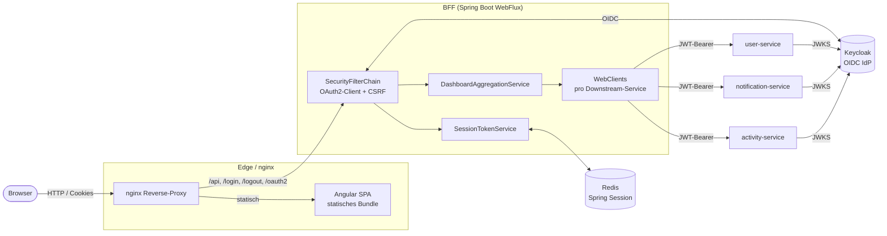
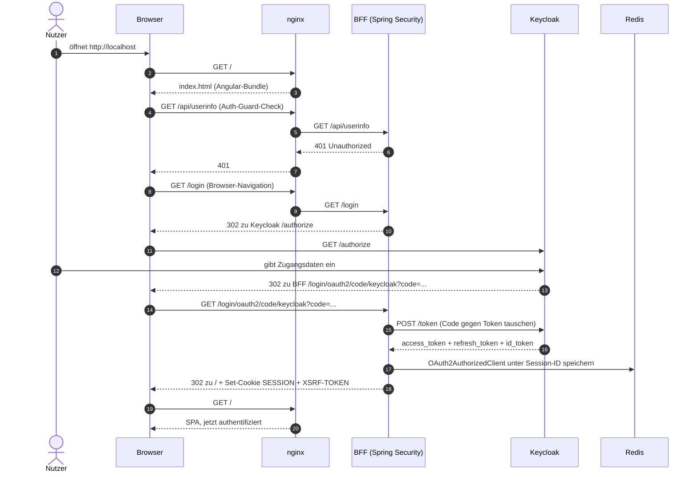
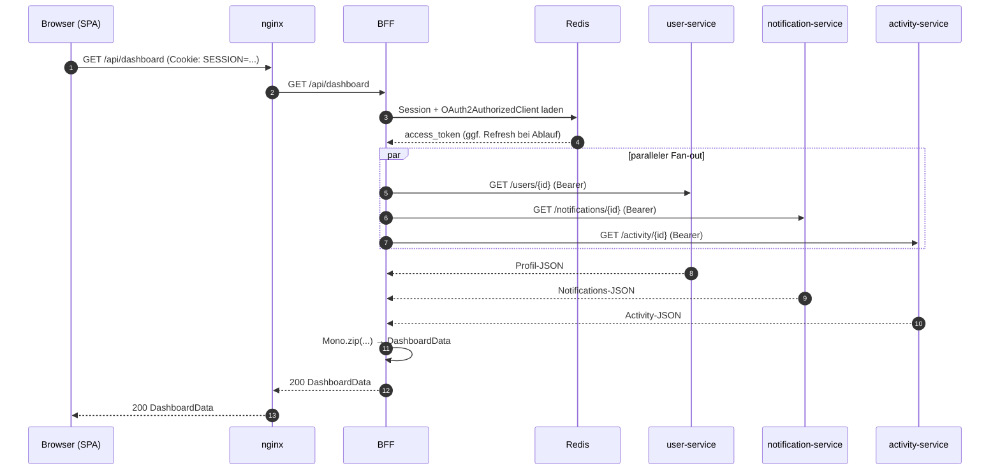

# Architektur

Dieses Dokument beschreibt die Architektur des BFF-Referenzprojekts: die
Komponenten, wie sie kommunizieren, und die drei zentralen Datenflüsse
(Login, API-Aufruf und Logout).

> **Begleitmaterial.** Die zugrunde liegende Architekturentscheidung — wann
> ein BFF gegenüber „Direct-to-Service" die bessere Wahl ist — ist in der
> Folienpräsentation [`BFF_Demo_Praesentation.pptx`](BFF_Demo_Praesentation.pptx)
> für Entscheider, Architekten und Full-Stack-Entwickler aufbereitet. Dieses
> Dokument setzt die Entscheidung als gegeben voraus und konzentriert sich
> auf die technische Umsetzung.
>
> Die Präsentation vergleicht zwei Architekturvarianten (**No-BFF** mit
> Browser-seitiger Aggregation/Orchestrierung vs. **With BFF** mit
> serverseitiger Komposition). Dieses Repository implementiert die
> **With-BFF**-Variante; die No-BFF-Variante ist als gedanklicher Kontrapunkt
> in Kapitel 3 & 6 der Folien visualisiert.

## Komponenten-Überblick


```mermaid
flowchart LR
    Browser([Browser])
    subgraph Edge["Edge / nginx"]
        SPA[Angular SPA<br/>statisches Bundle]
        Proxy[nginx Reverse-Proxy]
    end
    subgraph BFFNode["BFF (Spring Boot WebFlux)"]
        Sec[SecurityFilterChain<br/>OAuth2-Client + CSRF]
        Agg[DashboardAggregationService]
        Tok[SessionTokenService]
        Clients[WebClients<br/>pro Downstream-Service]
    end
    KC[(Keycloak<br/>OIDC IdP)]
    R[(Redis<br/>Spring Session)]
    US[user-service]
    NS[notification-service]
    AS[activity-service]

    Browser -- HTTP / Cookies --> Proxy
    Proxy -- statisch --> SPA
    Proxy -- /api, /login, /logout, /oauth2 --> Sec
    Sec --> Agg
    Sec --> Tok
    Tok <--> R
    Sec <-- OIDC --> KC
    Agg --> Clients
    Clients -- JWT-Bearer --> US
    Clients -- JWT-Bearer --> NS
    Clients -- JWT-Bearer --> AS
    US -- JWKS --> KC
    NS -- JWKS --> KC
    AS -- JWKS --> KC
```

### Komponenten

| Komponente            | Technologie                                 | Verantwortung                                                                   |
|-----------------------|---------------------------------------------|---------------------------------------------------------------------------------|
| Angular-SPA           | Angular 21, Standalone, Signals (Node 22 build) | Dashboard rendern, keine Auth-Logik, kein Token-Handling                        |
| nginx                 | nginx 1.29 alpine                           | SPA ausliefern, `/api`, `/login`, `/logout`, `/oauth2` zum BFF reverse-proxyen  |
| BFF                   | Spring Boot 4 WebFlux, Java 25              | OAuth2-Client, Session, CSRF, parallele Aggregation                             |
| Keycloak              | Keycloak 26.6                               | OIDC Identity Provider, JWKS-Endpunkt                                           |
| Redis                 | Redis 8 alpine                              | Session-Store (`spring-session-data-redis`)                                     |
| user-service          | Spring Boot 4 Resource Server (Java 25)     | Profildaten; validiert JWT gegen Keycloak-JWKS                                  |
| notification-service  | Spring Boot 4 Resource Server (Java 25)     | Benachrichtigungen; gleiche JWT-Validierung                                     |
| activity-service      | Spring Boot 4 Resource Server (Java 25)     | Aktivitätsereignisse; gleiche JWT-Validierung                                   |

### Hexagonales Layout (BFF)

```
de.bafa.bff
├── BffApplication
├── config        # SecurityConfig, RedisConfig, WebClientConfig, CorsConfig, BffProperties
├── domain
│   ├── model     # DashboardData, UserProfile, Notification, ActivityEvent…
│   └── port      # UserServicePort, NotificationServicePort, ActivityServicePort
├── application   # DashboardAggregationService, SessionTokenService
├── adapter
│   ├── web       # DashboardController, AuthController + DTOs
│   └── client    # UserServiceClient, NotificationServiceClient, ActivityServiceClient
└── security      # SessionInvalidationHandler, spezifische CSRF-/BFF-Filter
```

Die Application-Schicht spricht ausschließlich gegen Ports (Interfaces in
`domain.port`); die Client-Adapter in `adapter.client` sind der einzige Ort,
an dem `WebClient` vorkommt — sie implementieren diese Ports. Die
Web-Adapter in `adapter.web` rufen die Application-Services auf. Dadurch
ist der innere Kern vollständig ohne Spring oder HTTP testbar.

---

## Datenflüsse

### 1. Login-Flow


```mermaid
sequenceDiagram
    autonumber
    actor U as Nutzer
    participant B as Browser
    participant N as nginx
    participant BFF as BFF (Spring Security)
    participant KC as Keycloak
    participant R as Redis

    U->>B: öffnet http://localhost
    B->>N: GET /
    N-->>B: index.html (Angular-Bundle)
    B->>N: GET /api/userinfo (Auth-Guard-Check)
    N->>BFF: GET /api/userinfo
    BFF-->>N: 401 Unauthorized
    N-->>B: 401
    B->>N: GET /login (Browser-Navigation)
    N->>BFF: GET /login
    BFF-->>B: 302 zu Keycloak /authorize
    B->>KC: GET /authorize
    U->>KC: gibt Zugangsdaten ein
    KC-->>B: 302 zu BFF /login/oauth2/code/keycloak?code=...
    B->>BFF: GET /login/oauth2/code/keycloak?code=...
    BFF->>KC: POST /token (Code gegen Token tauschen)
    KC-->>BFF: access_token + refresh_token + id_token
    BFF->>R: OAuth2AuthorizedClient unter Session-ID speichern
    BFF-->>B: 302 zu / + Set-Cookie SESSION + XSRF-TOKEN
    B->>N: GET /
    N-->>B: SPA, jetzt authentifiziert
```

### 2. API-Aufruf-Flow (Dashboard-Aggregation)


```mermaid
sequenceDiagram
    autonumber
    participant B as Browser (SPA)
    participant N as nginx
    participant BFF as BFF
    participant R as Redis
    participant US as user-service
    participant NS as notification-service
    participant AS as activity-service

    B->>N: GET /api/dashboard (Cookie: SESSION=...)
    N->>BFF: GET /api/dashboard
    BFF->>R: Session + OAuth2AuthorizedClient laden
    R-->>BFF: access_token (ggf. Refresh bei Ablauf)
    par paralleler Fan-out
        BFF->>US: GET /users/{id} (Bearer)
        BFF->>NS: GET /notifications/{id} (Bearer)
        BFF->>AS: GET /activity/{id} (Bearer)
    end
    US-->>BFF: Profil-JSON
    NS-->>BFF: Notifications-JSON
    AS-->>BFF: Activity-JSON
    BFF->>BFF: Mono.zip(...) → DashboardData
    BFF-->>N: 200 DashboardData
    N-->>B: 200 DashboardData
```

Die Aggregation verwendet `Mono.zip`, sodass alle drei Downstream-Aufrufe
**parallel** auf dem WebFlux-Eventloop laufen. Jeder Aufruf hat ein
Timeout von 5 Sekunden. Fällt ein einzelner Service aus oder läuft in ein
Timeout, liefert der BFF eine partielle Antwort (die ausfallende Kachel
bekommt einen neutralen Default) statt das ganze Dashboard zu verwerfen.
Genau das ist in diesem Projekt mit *resilienter Aggregation* gemeint.

### 3. Logout-Flow

```mermaid
sequenceDiagram
    autonumber
    participant B as Browser (SPA)
    participant N as nginx
    participant BFF as BFF
    participant R as Redis
    participant KC as Keycloak

    B->>N: POST /logout (X-XSRF-TOKEN-Header + Cookie)
    N->>BFF: POST /logout
    BFF->>BFF: CSRF validieren (Double-Submit)
    BFF->>KC: POST /revoke refresh_token
    BFF->>R: Session + AuthorizedClient löschen
    BFF-->>B: 204 + Set-Cookie SESSION=; Max-Age=0
    B->>B: window.location = '/'
    B->>N: GET /
    N-->>B: SPA → Auth-Guard → 401 → /login
```

Die Token-Revocation gegen Keycloak ist Best-Effort: Ist Keycloak nicht
erreichbar, wird die lokale Session trotzdem zerstört und der Nutzer ist
aus diesem BFF ausgeloggt. Der nächste Login-Round-Trip authentifiziert
ihn dann erneut.

---

## Konfigurations-Oberfläche

Die gesamte Laufzeit-Konfiguration wird aus Umgebungsvariablen gelesen
(siehe `.env.example`). Die wichtigsten:

| Variable                                  | Zweck                                                              |
|-------------------------------------------|--------------------------------------------------------------------|
| `KEYCLOAK_ISSUER_URI`                     | Issuer-URL, über die BFF und Services Keycloak erreichen (intern)   |
| `KEYCLOAK_PUBLIC_ISSUER_URI`              | Issuer-URL, zu der der **Browser** umgeleitet wird                 |
| `KEYCLOAK_CLIENT_ID`/`SECRET`             | OIDC-Confidential-Client-Zugangsdaten                              |
| `REDIS_HOST` / `REDIS_PORT`               | Backing-Store für Spring Session                                   |
| `BFF_FRONTEND_ORIGIN`                     | Erlaubter CORS-Origin                                              |
| `BFF_SESSION_TIMEOUT_SECONDS`             | Max-Age des Session-Cookies, abgestimmt auf Refresh-Token-Laufzeit |
| `BFF_COOKIE_SECURE`                       | In Nicht-Lokalumgebungen `true`                                    |
| `USER/NOTIFICATION/ACTIVITY_SERVICE_URL`  | Interne Docker-Service-URLs                                        |

---

## Begründung der Entscheidungen

Die Begründungen und verworfenen Alternativen zu jeder tragenden Entscheidung
liegen in den ADRs unter [`adr/`](adr/) sowie dem Threat-Modell in
[`security-concept.md`](security-concept.md).
